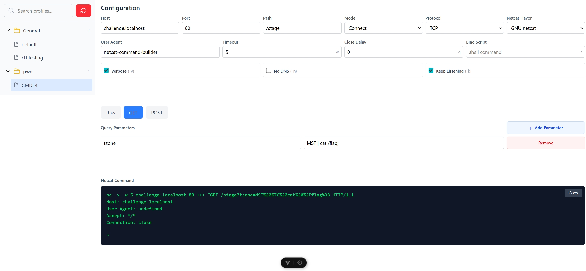

# nc-command-builder

A modern web-based GUI tool for visually constructing `netcat` commands. Built for CTF players, pentesters, and security professionals who need to quickly build complex netcat commands with proper payloads.



## Features

### Visual Command Builder
- **Real-time preview** — See your command update instantly as you change any parameter
- **Multiple netcat flavors** — Support for GNU netcat, OpenBSD netcat, FreeBSD netcat, Ncat (Nmap), and socat
- **Connection modes** — Configure connect or listen modes with proper flag handling
- **Protocol support** — TCP and UDP with correct flags for each flavor
- **Advanced options** — Verbose output, DNS resolution, timeout, close delay, bind addresses

### Payload Editor with Three Modes
- **Raw TCP** — Direct text input for custom payloads with complete control
- **HTTP GET** — Form-based builder for query parameters with automatic URL encoding
- **HTTP POST** — Key-value body builder with multiple content-type support:
  - `application/json`
  - `application/x-www-form-urlencoded`
  - `text/plain`
  - `text/html`
  - `application/xml`

### Smart Command Generation
- **Flavor-specific syntax** — Generates correct flags and syntax for each netcat variant
- **Automatic header construction** — Builds proper HTTP requests with Host, User-Agent, Content-Type, Content-Length, and Connection headers
- **URL encoding handling** — Proper encoding for query parameters and form data
- **Payload escaping** — Correct escape sequence handling for special characters

### Profile Management
- **Folder organization** — Postman-style folder system for organizing profiles
- **Save & load configurations** — Store complete configurations with a single click
- **Persistent storage** — Uses localStorage to persist your profiles across sessions
- **Quick switching** — Instantly switch between saved configurations

### Modern Web Interface
- **Responsive design** — Works on desktop and tablet screens
- **Fast & lightweight** — No backend required, runs entirely in your browser
- **Copy to clipboard** — One-click copying of generated commands
- **Real-time validation** — See your command update as you type

## Tech Stack

- **Vue 3** — Progressive JavaScript framework with Composition API
- **TypeScript** — Type-safe development
- **Vite** — Lightning-fast build tool and dev server
- **Pinia** — State management with persistence
- **Tailwind CSS v4** — Utility-first CSS framework
- **Vue DevTools** — Integrated debugging support

## Quick Start

### Prerequisites

- Node.js >= 18.0.0
- npm >= 9.0.0

### Installation & Development

```bash
# Clone the repository
git clone https://github.com/Benjamin-Chau/nc-command-builder.git
cd nc-command-builder

# Install dependencies
npm install

# Start development server
npm run dev
```

The application will be available at `http://localhost:5173`

### Build for Production

```bash
# Build the application
npm run build

# Preview the production build
npm run preview
```

The built files will be in the `dist/` directory, ready for deployment to any static hosting service.

## Usage Guide

### Connection Configuration

Configure the target and connection settings in the top panel:

| Field | Options | Default |
|-------|---------|---------|
| Host | Any hostname or IP address | `localhost` |
| Port | Any valid port number | `8080` |
| Path | URL path for HTTP requests | `/` |
| Mode | Connect, Listen | `Connect` |
| Protocol | TCP, UDP | `TCP` |
| Netcat Flavor | GNU netcat, OpenBSD netcat, FreeBSD netcat, Ncat, socat | `GNU netcat` |

### Advanced Options

Configure additional netcat flags:

| Option | Flag | Description |
|--------|------|-------------|
| Verbose | `-v` | Enable verbose output |
| No DNS | `-n` | Skip DNS resolution (faster for IP addresses) |
| Keep Listening | `-k` | Keep accepting connections after first closes (listen mode only) |
| Timeout | `-w N` | Connection/read timeout in seconds |
| Close Delay | `-q N` | Wait after EOF before closing |
| Bind Address | `-s IP` | Bind to specific local address |

### Payload Modes

#### Raw Mode
For complete control over your payload:
- Enter any custom payload text
- Supports escape sequences like `\r\n`, `\x41`, etc.
- Direct passthrough to netcat

#### GET Mode
Build HTTP GET requests with query parameters:
- Add multiple key-value parameter pairs
- Automatic URL encoding
- Generates proper HTTP GET request with headers
- Supports dynamic path and query string construction

#### POST Mode
Create HTTP POST requests with body content:
- Choose content type (JSON, form-encoded, text, etc.)
- Add multiple body parameters
- Automatic Content-Length calculation
- Generates properly formatted POST requests

### Profile Management

The left sidebar provides Postman-style profile management:

1. **Create Folders** — Organize your profiles into custom folders
2. **Save Profiles** — Save your current configuration with a custom name
3. **Load Profiles** — Click any profile to instantly load its configuration
4. **Delete Profiles** — Remove profiles you no longer need
5. **Folder Operations** — Rename or delete folders as needed

All profiles are automatically persisted to localStorage and survive browser restarts.

### Example Commands

#### Simple TCP Connection
```
nc -v -n -w 5 localhost 8080
```

#### HTTP GET Request
```
printf "GET / HTTP/1.1\r\nHost: localhost\r\nUser-Agent: netcat-command-builder\r\nAccept: */*\r\nConnection: close\r\n\r\n" | nc -v -n -w 5 localhost 8080
```

#### HTTP POST with JSON
```
printf "POST /api HTTP/1.1\r\nHost: localhost\r\nUser-Agent: netcat-command-builder\r\nContent-Type: application/json\r\nContent-Length: 27\r\nConnection: close\r\n\r\n{\"key\":\"value\",\"foo\":\"bar\"}" | nc -v -n -w 5 localhost 8080
```

#### Listen Mode with Keep-Alive
```
nc -l -k -v localhost 8080
```

#### UDP Connection
```
nc -u -v -n localhost 8080
```

## Project Structure

```
nc-command-builder/
├── src/
│   ├── components/          # Vue components
│   │   ├── ConfigArea.vue    # Connection configuration panel
│   │   ├── PayloadArea.vue   # Payload editor (Raw/GET/POST)
│   │   ├── PreviewArea.vue  # Command generation and preview
│   │   └── ProfileArea.vue   # Profile management sidebar
│   ├── App.vue               # Main application layout
│   ├── main.ts               # Application entry point
│   ├── models.ts             # TypeScript interfaces (Profile, Folder)
│   ├── stores.ts             # Pinia state management
│   └── style.css             # Global styles
├── public/                    # Static assets
├── screenshot/                # Application screenshots
├── index.html                 # HTML template
├── package.json              # Dependencies and scripts
├── vite.config.ts            # Vite configuration
├── tsconfig.json             # TypeScript configuration
├── tailwind.config.js        # Tailwind CSS configuration
└── README.md                 # This file
```

## Architecture

### State Management
The application uses **Pinia** for state management with two synchronized stores:

- **useFolderStore** — Manages folder organization and profile storage
- **useProfileStore** — Manages the currently active profile

Both stores persist to localStorage automatically, ensuring your work is never lost.

### Component Architecture
The application follows a clean component-based architecture:

- **ProfileArea** — Handles profile CRUD operations and folder management
- **ConfigArea** — Manages connection settings and advanced options
- **PayloadArea** — Provides three-mode payload editing with form-based builders
- **PreviewArea** — Generates flavor-specific netcat commands with proper syntax

### Data Flow
```
User Input → Component State → Pinia Store → Command Generation → Live Preview
```

All profile changes are synchronized between the active profile and folder storage, ensuring consistency across the application.

## Browser Compatibility

- Chrome/Edge >= 90
- Firefox >= 88
- Safari >= 14

## Contributing

Contributions are welcome! Please feel free to submit issues or pull requests.

## License

Apache-2.0 - See LICENSE file for details

## Acknowledgments

Inspired by the need for better netcat command generation tools in CTF and security testing scenarios. This project aims to bridge the gap between manual command construction and visual GUI builders.